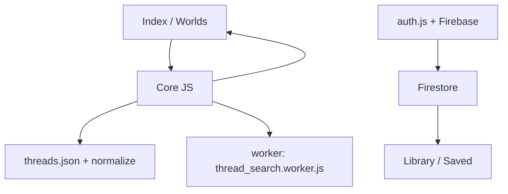

# Toàn cảnh ThreadColor

## Mục tiêu
ThreadColor là World “Thế giới màu thêu” trong hệ sinh thái 8Portals, tập trung vào tra mã chỉ theo màu, hỗ trợ lọc theo hãng, xác minh dữ liệu và công cụ kiểm tra màu chuyên sâu.

## Sơ đồ tổng quan (Mermaid)

## Module map (đi kèm đường dẫn)
- UI:
  - `index.html` (Sảnh điều phối)
  - `worlds/threadcolor.html` (World 1)
  - `worlds/threadvault.html` (Kho chỉ)
- Core logic:
  - `script.js` (tìm kiếm, render, inspector, library)
- Dữ liệu:
  - `threads.json`
  - `data_normalize.js` (chuẩn hoá + confidence)
- Worker:
  - `workers/thread_search.worker.js`
- Auth + Firestore:
  - `auth.js`, `library.js`, `crowd.js`
- I18n:
  - `i18n.js`

## Trách nhiệm module (tóm tắt)
| Module | Vai trò | Owner (tạm) | Rủi ro |
|---|---|---|---|
| `script.js` | Tìm kiếm, render, UI logic chính | @repo-owner | Hiệu năng/lag nếu query nặng |
| `data_normalize.js` | Chuẩn hoá dữ liệu đầu vào | @repo-owner | Sai confidence làm lọc verified rỗng |
| Worker | Tối ưu tìm kiếm nặng | @repo-owner | Sai contract làm UI lỗi |
| Auth/Library | Đăng nhập + lưu kết quả | @repo-owner | Quyền Firestore, UX login |

## Khi muốn sửa tính năng X
- “Tìm mã chỉ gần nhất”: `script.js` + `workers/thread_search.worker.js`
- “Tra theo mã chỉ”: `script.js` + `threadsByCode` index
- “Lọc chỉ đã xác minh”: `data_normalize.js` + `isVerifiedThread`
- “Lưu/Thư viện”: `library.js` + `script.js`

## Guardrails bắt buộc
- Không phá login top-right (#topbarAuthSlot).
- Không phá filter hãng + trạng thái “Xong. Dữ liệu đã sẵn sàng.”
- Không đổi id/class đang được JS sử dụng.
